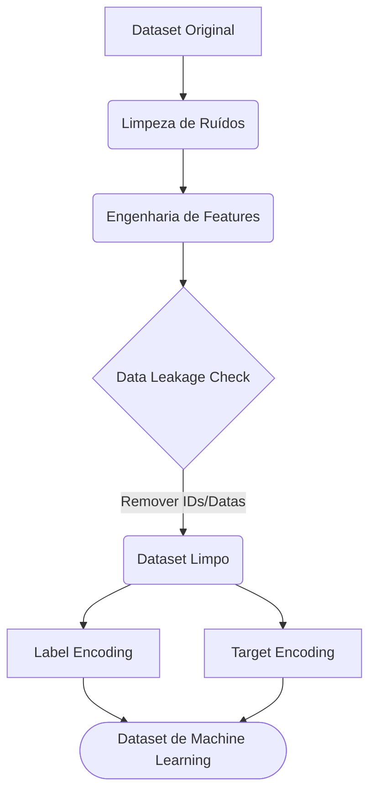

# Conhecendo os Dados e Preparação para Modelagem

Nesta seção, realizamos uma Análise Exploratória de Dados (EDA) aprofundada e a Engenharia de Features para compreender o comportamento dos pacientes do sistema de saúde (SUS) de Vitória/ES. O objetivo final desta etapa é extrair *insights* sobre o absenteísmo (variável alvo `No-show`) e preparar um *dataset* íntegro, ético e matematicamente formatado para a etapa de Machine Learning.

## Limpeza e Tratamento Inicial

O dataset original mostrou-se bastante íntegro, sem valores nulos ou linhas duplicadas irrecuperáveis. No entanto, na etapa de detecção de anomalias, identificamos um erro de digitação no sistema médico: um paciente com idade `-1`. Esse registro único foi removido (passando de 110.527 para 110.526 linhas) para não comprometer as medidas de dispersão. Também realizamos a Engenharia de Variáveis, transformando as datas brutas de agendamento e consulta na variável contínua `DiasEspera`.

## Medidas de Tendência Central e Dispersão

Avaliamos as variáveis quantitativas do dataset e seus *outliers*:

* **Idade (Age):** A média de idade dos pacientes é de 37 anos, com a mediana também em 37. A dispersão vai de 0 (recém-nascidos, que representam um pico de comparecimento) até *outliers* naturais de longevidade (115 anos), que foram mantidos por serem dados reais do sistema de saúde.
* **Dias de Espera (DiasEspera):** Identificamos que a mediana de espera para quem comparece é de apenas 2 dias (com média de 8,8 dias). Para os faltosos, a média salta para 15,8 dias, com o Intervalo Interquartil (IQR) muito mais alongado, evidenciando o peso matemático do tempo no abandono da consulta.

## Visualizações e Trechos de Código

Utilizamos histogramas para entender a distribuição etária, gráficos de barras para conversão de categorias e *boxplots* para avaliar a dispersão cruzada. Abaixo, destacamos o trecho de código responsável por criar a variável de tempo e gerar a análise visual de dispersão que baseou nossa principal descoberta:

```python
import pandas as pd
import matplotlib.pyplot as plt
import seaborn as sns

# 1. Feature Engineering: Criando a variável de tempo de espera
df["ScheduledDay"] = pd.to_datetime(df["ScheduledDay"])
df["AppointmentDay"] = pd.to_datetime(df["AppointmentDay"])
df["DiasEspera"] = (df["AppointmentDay"] - df["ScheduledDay"]).dt.days

# Removendo inconsistências temporais (consultas agendadas para o passado)
df = df[df["DiasEspera"] >= 0]

# 2. Visualização de Dispersão e Outliers (Box plot)
plt.figure(figsize=(8, 5))
sns.boxplot(data=df, x='No-show', y='DiasEspera', palette=['#4C72B0', '#DD8452'])
plt.title('Dias de Espera vs. Status de Comparecimento')
plt.xlabel('Faltou? (0 = Não, 1 = Sim)')
plt.ylabel('Dias de Espera')
plt.show()
```
*(Nota: O código fonte completo, contendo matrizes de correlação de Spearman, histogramas e tratamentos, encontra-se disponível no ambiente Google Colab: https://colab.research.google.com/drive/1GR-eJyyqYYrNghVvF3EF_UwG9ITsuQOt?usp=chrome_ntp#scrollTo=HsgyBNiINrEG).*

## Insights para o Overbooking Responsável

Após a EDA, constatamos que o absenteísmo médio no sistema é de **20,2%** (2 em cada 10 horários desperdiçados). Para mitigar esse prejuízo via **Overbooking Responsável**, mapeamos os padrões de risco que alimentarão o modelo preditivo. 

Separamos os **fatos comprovados pelos dados** das **hipóteses comportamentais**:

### Tempo (Dias de Espera)
* **Dado:** A média de espera de quem comparece é de **8,8 dias** (com mediana em 2 dias). Para os faltosos, a média salta para **15,8 dias**.
* **A Implicação Prática:** Agendamentos longos (acima de 15 dias) são os principais candidatos algorítmicos a receberem vagas de encaixe, dado o maior risco estatístico de abandono.

### Perfil Demográfico (Idade)
* **Dado:** O risco de ausência concentra-se estritamente na faixa dos **17 aos 50 anos** (com a mediana de faltas exata aos 33 anos). Pediatria e geriatria possuem alta adesão.
* **A Hipótese de Negócio:** Supomos que o grupo de 17 a 50 anos sofra com conflitos de horário comercial e acadêmico, explicando a correlação com a evasão. Bebês e idosos costumam ter maior acompanhamento familiar ou rotinas mais flexíveis.

### Comorbidades
* **Dado:** A taxa de absenteísmo cai para **15,4%** entre os hipertensos e **18,0%** entre os diabéticos (abaixo da média global).
* **A Implicação Prática:** A dependência de uma rotina médica gera maior engajamento. Agendas de pacientes crônicos não são boas candidatas para *overbooking*.

### Risco Geográfico
* **Dado (Identificação de Hotspots):** Bairros como Santos Dumont e Santa Clara lideram a Taxa Proporcional de Absenteísmo (encostando em 29%). Além disso, a média de idade de quem falta nessas regiões críticas é menor que a de quem comparece.
* **A Hipótese de Negócio (Requer Validação Externa):** Nossa hipótese é que moradores dessas localidades enfrentem dificuldades logísticas (distância, transporte) ou possuam jornadas de trabalho inflexíveis, dificultando a liberação do jovem adulto para consultas.

## Proposta de Preparação Final para Modelagem

Para a transição da Etapa 2 para a Etapa 3 (Modelagem), o dataset precisa ser codificado e tratado. Sugerimos seguir com a seguinte propsta de preparação do dataset para a modelagem de dados que ocorerrá na etapa 3. 


### Mitigação de Vazamento de Dados

Para garantir que o modelo aprenda padrões estatísticos e não apenas decore o passado (Overfitting), excluímos variáveis que só estariam disponíveis no futuro ou que atuam como identificadores únicos:

* **PatientId e AppointmentID:** Removidas.
* **ScheduledDay e AppointmentDay:** Removidas após a extração de `DiasEspera`.
* **Neighbourhood (Texto):** Removida após a aplicação do Target Encoding.

### Dicionário de Variáveis e Transformações

| Variável | Papel no ML | Transformação Aplicada | Justificativa Técnica |
| :--- | :--- | :--- | :--- |
| **NoShow_numeric** | Alvo (Target) | Label Encoding (0/1) | A variável que o modelo aprenderá a prever. |
| **DiasEspera** | Feature | Engenharia de Datas | O principal motor preditivo, extraído das datas brutas. |
| **Age** | Feature | Limpeza de Ruído | Escala numérica mantida. Correlação negativa com o alvo. |
| **Gender_numeric** | Feature | Label Encoding | Transformação de 'M/F' para binário (0/1). |
| **Neighbourhood_Risk** | Feature | Target Encoding | Substituição do nome do bairro pela sua taxa histórica de evasão, capturando o risco sem explodir a dimensionalidade. |
| **SMS_received, Hipertension, etc** | Features | Nenhuma (Original) | Variáveis binárias mantidas para avaliar o contexto social e clínico. |

## Ética, Privacidade (LGPD) e Impacto Social

Trabalhar com dados do Sistema Único de Saúde (SUS) exige um protocolo rigoroso de governança:

* **Anonimização (LGPD):** Com o descarte do `PatientId` e `AppointmentID`, o dataset de modelagem foi anonimizado. É impossível realizar a reidentificação dos indivíduos.
* **Mitigação de Vieses Discriminatórios:** Marcadores socioeconômicos (como Scholarship) e geográficos (Neighbourhood_Risk) não devem ser usados pelo algoritmo para punir populações vulneráveis. Monitoraremos métricas de Fairness na Etapa 3 para garantir que o modelo não assuma um comportamento discriminatório.
* **Overbooking como Suporte:** A IA emitirá um "alerta de probabilidade de falta" para cada consulta. Esse alerta deve atuar como suporte à decisão (*Human-in-the-Loop*), e não como um sistema automatizado cego, evitando superlotações ou penalizações a pacientes que sofreram imprevistos justificados.

## Ferramentas Utilizadas

* **Python (v3.x):** Linguagem padrão para manipulação estatística.
* **Google Colab:** Ambiente de desenvolvimento interativo.
* **Pandas & NumPy:** Manipulação tabular e agregações matemáticas.
* **Matplotlib & Seaborn:** Validação gráfica de hipóteses.
* **Git & GitHub:** Versionamento e documentação do projeto.
